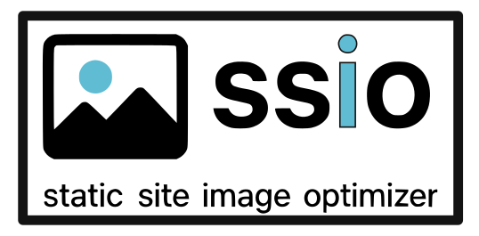

# Static Site Image Optimizer (ssio)



Recursively converts images in a directory to WebP and updates references in HTML/CSS/JS files, quickly and safety

## Installation

```bash
git clone https://github.com/yourusername/StaticSiteImageOptimizer.git
cd StaticSiteImageOptimizer
chmod +x ssio
```

The first time you run `./ssio`, it will automatically create the virtual environment and install dependencies using pixi, uv, or python3 (whichever is available).

To use `ssio` globally, add a symlink:

```bash
sudo ln -s $(pwd)/ssio /usr/local/bin/ssio
```

## Usage

Convert all images in a directory to WebP:

```bash
./ssio /path/to/directory
```

Or if installed globally:

```bash
ssio /path/to/directory
```

### Options

- `--quality <0-100>` - WebP quality (default: 80)
- `--dry-run` - Preview changes without making them
- `--backup` - Create .bak copies of modified files
- `--delete-original` - Remove original images after conversion
- `--extensions <list>` - Comma-separated image extensions (default: .jpg,.jpeg,.png,.gif,.bmp,.tiff)
- `--include <list>` - Comma-separated text file extensions to update (default: .html,.css,.js)
- `--log-level <level>` - DEBUG, INFO, WARNING, ERROR (default: INFO)

### Examples

Basic usage:

```bash
./ssio .
```

Custom quality with backup:

```bash
./ssio /path/to/site --quality 85 --backup
```

Dry run mode:

```bash
./ssio . --dry-run
```

Delete originals:

```bash
./ssio . --delete-original
```

Custom file extensions:

```bash
./ssio . --extensions .jpg,.png --include .html,.css
```

Complete example:

```bash
./ssio . --quality 80 --backup --dry-run --log-level DEBUG
```

## Features

- Recursively scan directories for image files and convert them to WebP
- Update references across HTML, CSS, and JS files to use the generated WebP files
- Dry-run mode to preview changes
- Optional deletion of original files after successful conversion
- Optional backup of modified files (creates .bak)
- Configurable quality settings (0-100)
- Support for multiple image formats (jpg, jpeg, png, gif, bmp, tiff)

## Notes

- The tool replaces references by matching filenames and computing relative paths
- This is pragmatic and may not cover all edge cases (e.g., dynamic JS templates or complex srcset handling)
- Add original image formats to .gitignore but keep WebP files tracked
- Safety checks prevent running as root or at filesystem root directories
- Use `--backup` flag to create .bak files that can be reverted

## Reverting Changes

To revert changes made by ssio:

```bash
./ssio-revert /path/to/directory
```

Options:
- `--remove-webp` - Also remove .webp files
- `--dry-run` - Preview what would be reverted
- `--extensions <list>` - File extensions to revert (default: .html,.css,.js)

## Test

To test the tool with sample data:

```bash
cd test
./download_images.sh
uv run test_conversion.py
```

This will convert images in `test/img/` and update references in `test/index.html` without deleting originals.
